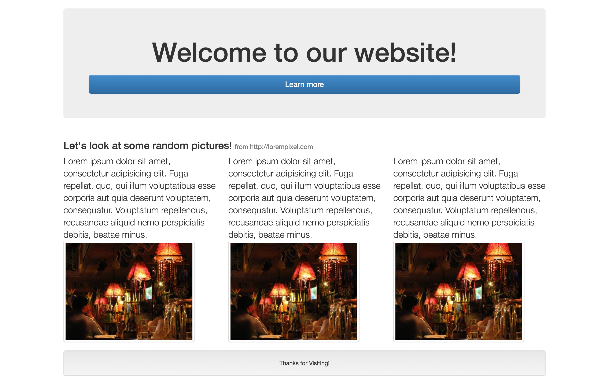
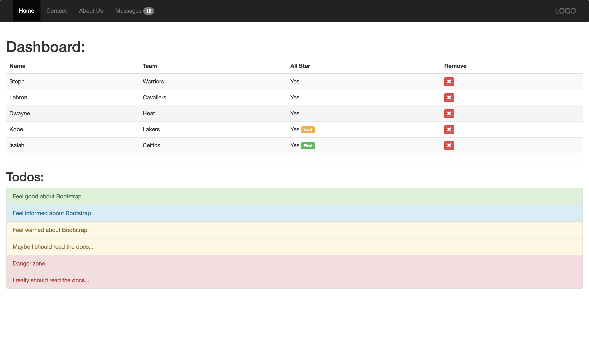

## Bootstrap Mocks

For this assignment you should **only** use Twitter Bootstrap and [lorem pixel](http://lorempixel.com) for placeholder images.

### Part 1:

Write the necessary code to make your page look just like this one:

### Part 2:

Write the necessary HTML to make your page look just like this one:

