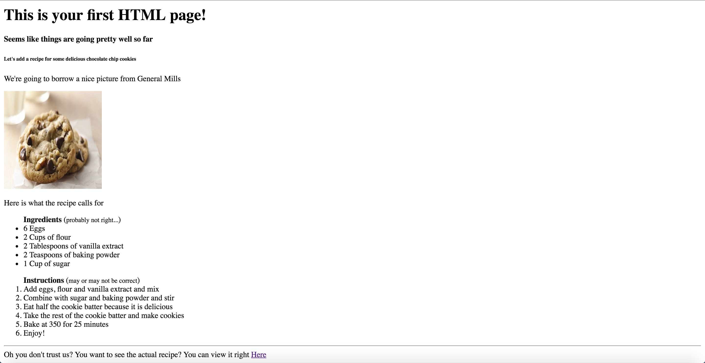
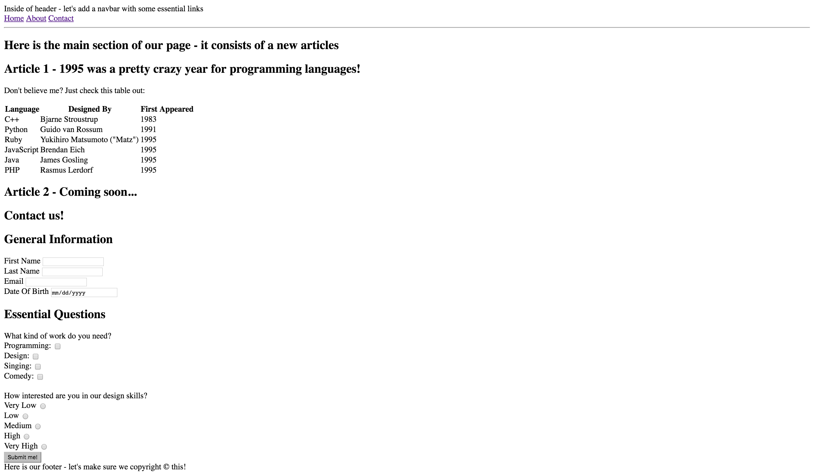

# HTML Exercises

## Part 1:

Write the necessary HTML to make your page look just like this one:

## Part 2:

Write the necessary HTML to make your page look just like this one:

## Part 3

Write the necessary HTML to make your page look just like this one - don't worry about the song / video being the same - you can put whatever you'd like!

